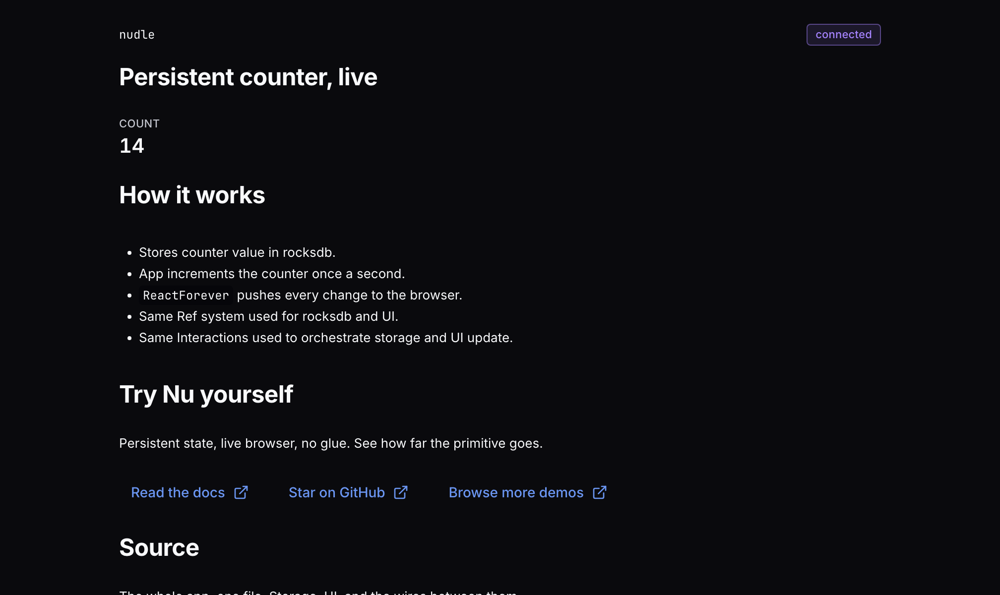
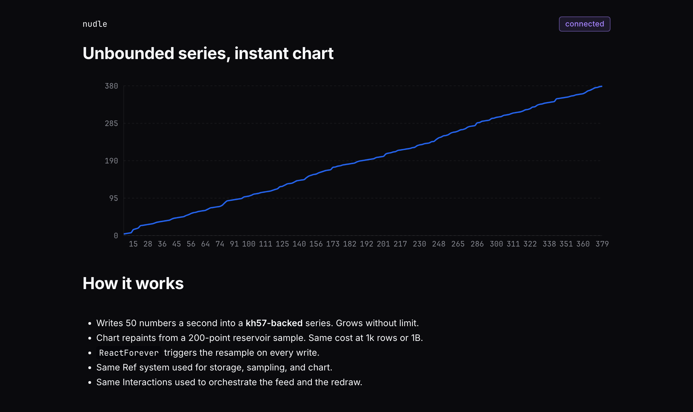
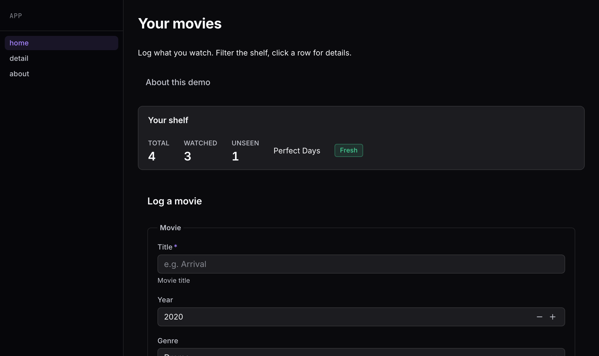

<div align="center">
  <table>
    <tbody>
      <tr>
        <td>Drop a star to support Nu ⭐</td>
        <td>
          <a href="https://discord.gg/tCa8YE7XVr">Join the Nu Discord community</a>
        </td>
      </tr>
    </tbody>
  </table>
</div>

<div align="center">
  
  <h3>
    Nu – the interaction primitive
  </h3>
  Build apps in one primitive that spans your whole stack — databases, UIs, AI agents, and services. No glue. 50x less code.
</div>

<br/>

<div align="center">

  [](https://discord.gg/tCa8YE7XVr)
  [](https://twitter.com/nustackdev)

  []()
  [](https://pypi.org/project/nustack-py/)
  [](https://pypi.org/project/nustack-py/)
  [](https://opensource.org/licenses/Apache-2.0)
  [](https://pypi.org/project/nustack-py/)

</div>

<br/>

---

<h3 align="center">
  <a href="#ℹ️-about"><b>About</b></a> &bull;
  <a href="#-quickstart"><b>Quickstart</b></a> &bull;
  <a href="#-fabrics"><b>Fabrics</b></a> &bull;
  <a href="#-apps-built-on-nu"><b>Apps</b></a> &bull;
  <a href="#-spec"><b>Spec</b></a> &bull;
  <a href="https://github.com/nustackdev/nu/tree/main/examples"><b>Examples</b></a> &bull;
  <a href="https://nustack.dev/docs"><b>Documentation</b></a> &bull;
  <a href="#-community"><b>Community</b></a>
</h3>

---

# ℹ️ About

A tiny program is a joy to write. Three lines, one substrate:

```python
a = 2
b = 5
print(a + b)
```

Real apps don't stay here. `a` moves into a database. `b` comes from a form submission. The result renders in a browser. A background job reruns it when either input changes. Three lines become three hundred: an ORM, a request handler, a template, a websocket, a queue. Almost none of it is about `a + b` anymore — it's all interaction between substrates.

**Nu makes interaction the primitive.**

- **Ref** — a name for a value, wherever it lives. A KV slot, a UI widget, an LLM endpoint, a remote object.
- **Interaction** — what you do with a Ref. Read, write, branch, iterate, compose.
- **Fabric** — binds Refs to a real backend.

Same program, `a` and `b` persisted in a KV store:

```python
import nu


class DB(nu.Shape):
    a = nu.kv.IntRef.slot()
    b = nu.kv.IntRef.slot()


# compute a + b and print it
compute = DB.a.set(2) >> DB.b.set(5) >> nu.print(DB.a + DB.b)

# assemble: rocksdb-backed
app = nu.With(
    nu.kv.rocksdb_navigator(".dbsum"),
    body=nu.kv.auto_flow_atomic(compute),
)

nu.run(app)
```

Same program, result rendered in a live browser dashboard:

```python
import asyncio
import nu


class DB(nu.Shape):
    a = nu.kv.IntRef.slot()
    b = nu.kv.IntRef.slot()


class Dashboard(nu.ui.Page):
    out = nu.ui.TextRef.slot()


class App(nu.ui.Index):
    pages = nu.ui.Pages({"/": Dashboard})


# compute a + b and render into the dashboard text block
compute = DB.a.set(2) >> DB.b.set(5) >> Dashboard.out.set(DB.a + DB.b)

# assemble: rocksdb-backed, served over the browser
app = nu.With(
    nu.kv.rocksdb_navigator(".dbsum"),
    nu.ui.server(nu.kv.auto_flow_atomic(compute)),
)

asyncio.run(nu.arun(app))
```

> **Same primitive, different substrate.** One Ref for any resource, one Interaction for any op. Nu doesn't care what the backend is.

Persistence, reactivity, atomicity, observability, distribution — not features Nu has. What falls out of naming interactions instead of executing them:

- **Persist across restarts** — the KV slot is already durable.
- **Re-render live on input changes** — wrap in a `React` interaction.
- **Handle terabytes** — shard the KV Fabric; the Refs don't notice.
- **Run distributed across a cluster** — bind through `nu.ray`; the Refs don't notice.

Full walkthrough at [nustack.dev](https://nustack.dev).

# 🏁 Quickstart

Three steps: install, run a demo, explore Nu.

### 01 · Install

Python 3.10+ &middot; everything ships in the wheel.

```bash
pip install "nustack-py[all]"
```

### 02 · Run a demo

Each one boots a live browser dashboard and picks up where it left off on restart. `nu demo` lists them all.

| counter | sampled |
| :--- | :--- |
|  A live counter, persistent across restarts. <br> `nu demo counter` |  An infinite series, live-sampled into a line-chart. <br> `nu demo sampled` |
| **movies** |   |
|  A movie tracker: form, filterable table, detail pages. <br> `nu demo movies` |   |

### 03 · Explore Nu

- **[Read the docs](https://nustack.dev/docs)** — tutorials, how-tos, and the fabric reference.
- **[Browse examples](https://github.com/nustackdev/nu/tree/main/examples)** — full source for every demo, plus more programs to steal from.

# 🧵 Fabrics

Each fabric binds Refs to a real backend and unlocks a new capability.

| Fabric | What |
| --- | --- |
| [`nu.mem`](https://nustack.dev/docs/reference/fabrics/mem) | In-memory state fabric. Perfect for cache, hot state, and in-process coordination. |
| [`nu.kv`](https://nustack.dev/docs/reference/fabrics/virtuals) | Persistent state fabric. Refs over a KV backend (RocksDB, LMDB); transactions, snapshots, and change notifications, built in. |
| [`nu.ui`](https://nustack.dev/docs/reference/fabrics/ui) | Web UI fabric. Same fabric shape as the others, but the Refs are widgets — text, buttons, tables — rendered in the browser and live-updated as your state changes. |
| [`nu.invisibles`](https://nustack.dev/docs/reference/fabrics/invisibles) | Network fabric. Puts other fabrics on the network — bind a fabric in one process, use it from another; same Refs, same interactions, over TCP or Unix socket. |
| [`nu.ray`](https://nustack.dev/docs/reference/fabrics/ray) | Cluster compute fabric. Teleport a Nu tree to any worker in your Ray cluster; it runs there and returns the result. |

# 📦 Apps built on Nu

End-user tools written as Nu programs.

| Repo | What |
| --- | --- |
| [nustackdev/nulog](https://github.com/nustackdev/nulog) | Pure-Python, serverless logger and metrics store. Log and observe metrics from any Python code; entries persist to an embedded KV store and scale to billions, in-process. One line boots a live viewer. |

# 📐 Spec

Nu is a reference implementation of the interaction model — a language-agnostic specification of what an interaction is, how Refs name locations, and how Interactions compose into programs.

[nustackdev/interaction-model](https://github.com/nustackdev/interaction-model)

# 🛣️ Roadmap

TODO.

# 👥 Community

## Nu README badge

Add a Nu badge to your README if you're building on Nu:

[](https://github.com/nustackdev/nu)

```
[](https://github.com/nustackdev/nu)
```

## Contributing to Nu

Considering contributing to Nu? Start by opening an issue or a PR — the codebase is small and readable, and the model is stable enough to build on.

## More questions?

1. [Read the docs](https://nustack.dev/docs)
2. [Open a feature request or report a bug](https://github.com/nustackdev/nu/issues)
3. [Join the Discord community](https://discord.gg/tCa8YE7XVr)

# License

Apache-2.0
